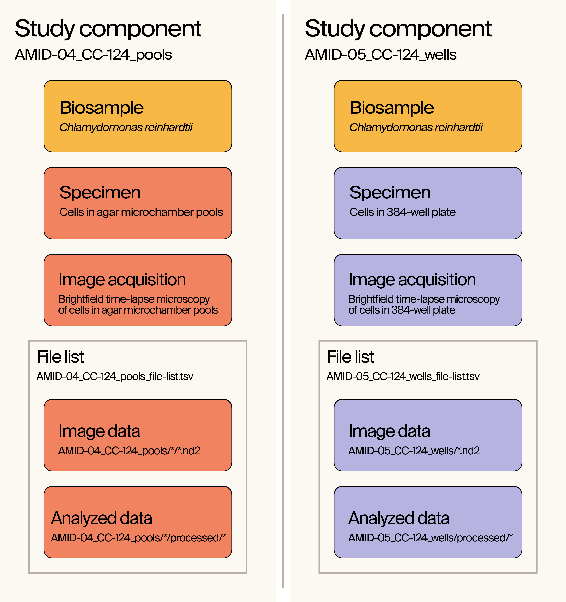

## Data

The full 355 GB dataset that accompanies the [pub](https://doi.org/10.57844/.arcadia-2d61-fb05) can be downloaded from the BioImage Archive (DOI: [10.6019/S-BIAD1298](https://doi.org/10.6019/S-BIAD1298)).

### Contents

The data in this repository is limited to files related to the archived dataset and summary motility statistics that were used for statistical analysis as explained below.

**Nomenclature**  
We acquired brightfield time-lapse microscopy data of cells swimming in two different types of vessels (agar microchamber pools and 384-well plates). As such, different names are used to identify the different acquisitions.
* Agar microchamber pools (aka "pools") --> `AMID-04`
* 384-well plate (aka "wells") --> `AMID-05`

```bash
2024-unicellular-tracking/data
├── AMID-04_CC-124_pools_file-list.tsv
├── AMID-05_CC-124_wells_file-list.tsv
├── AMID-04_summary_motility_metrics.csv
├── AMID-05_summary_motility_metrics.csv
├── experimental_parameters.json
└── README.md
```

* `AMID-04_CC-124_pools_file-list.tsv` and `AMID-05_CC-124_wells_file-list.tsv`  
  The [file lists](https://www.ebi.ac.uk/bioimage-archive/help-file-list/) that accompany each of the study components related to the BioImage Archive dataset. These serve as records of all the files that were uploaded to the archive.
* `AMID-04_summary_motility_metrics.csv` and `AMID-05_summary_motility_metrics.csv`  
  CSV files of summary motility metrics used to perform the statistical analysis described in the pub. Each row contains metrics such as the total time, mean curvilinear speed, and number of rotations from an individual cell trajectory. These CSV files were generated by running [`1_compute-summary-motility-metrics.ipynb`](../notebooks/1_compute-summary-motility-metrics.ipynb) and are used as input in each of the subsequent notebooks.
* `experimental_parameters.json`  
  This json file is used to map the motility metrics of a particular cell to its experimental conditions.


### Study components
Datasets uploaded to the BioImage Archive are organized into [study components](https://www.ebi.ac.uk/bioimage-archive/rembi-help-examples/), which is a framework used by the BioImage Archive to provide context for the pipeline in which a dataset was generated (e.g. sample preparation, image acquisition, and analysis methods). Each study component is accompanied by a TSV file that lists every file included in the study component as explained above. A visual representation of the study components pertaining to this work is shown below, while more complete descriptions are provided with the [dataset](https://doi.org/10.6019/S-BIAD1298) itself.


